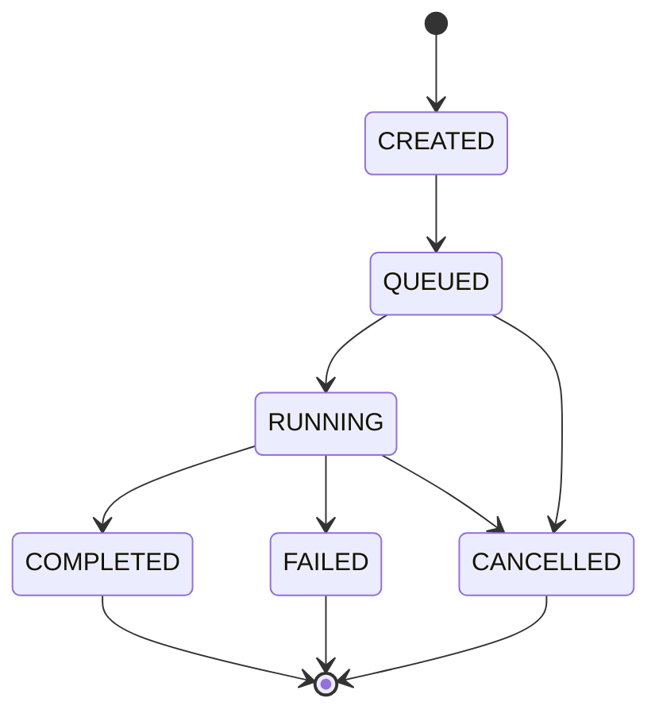
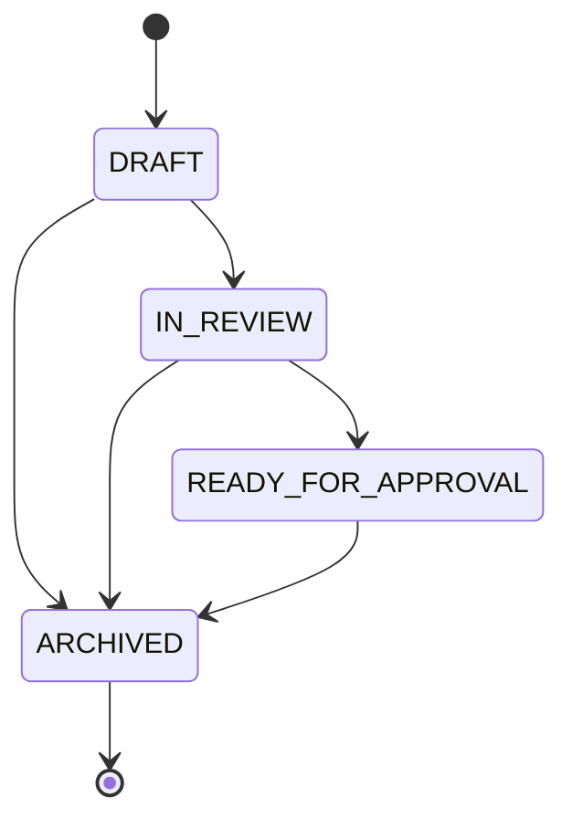
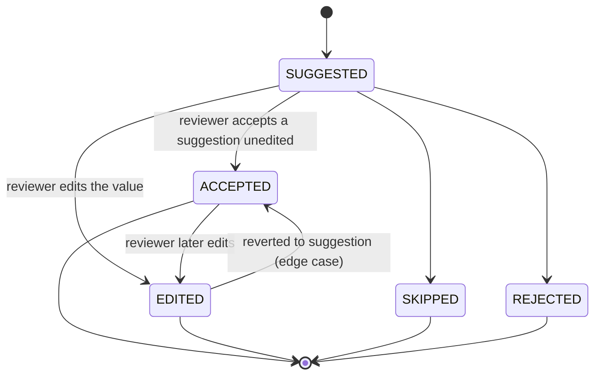
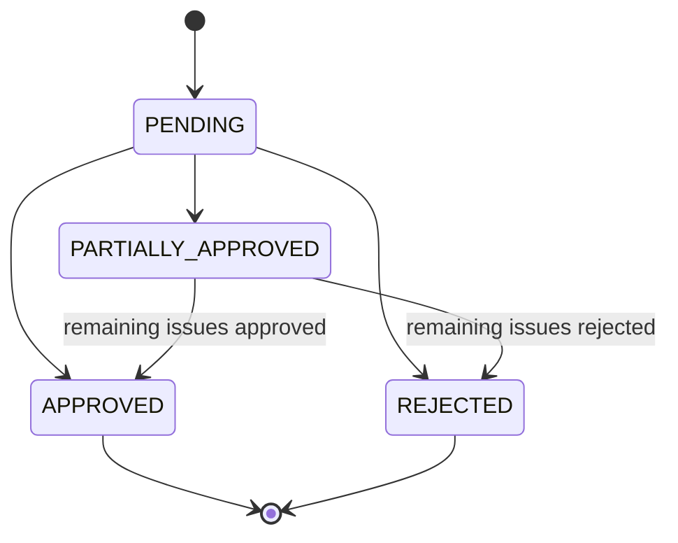
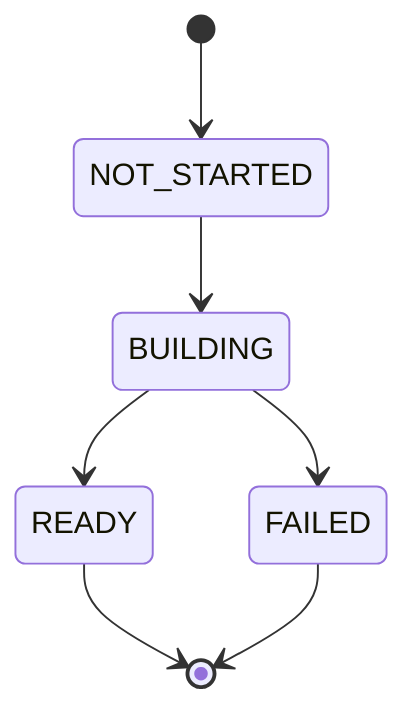
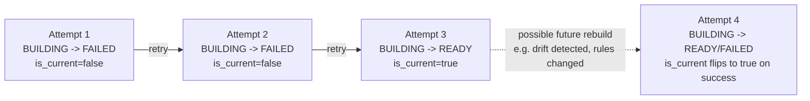
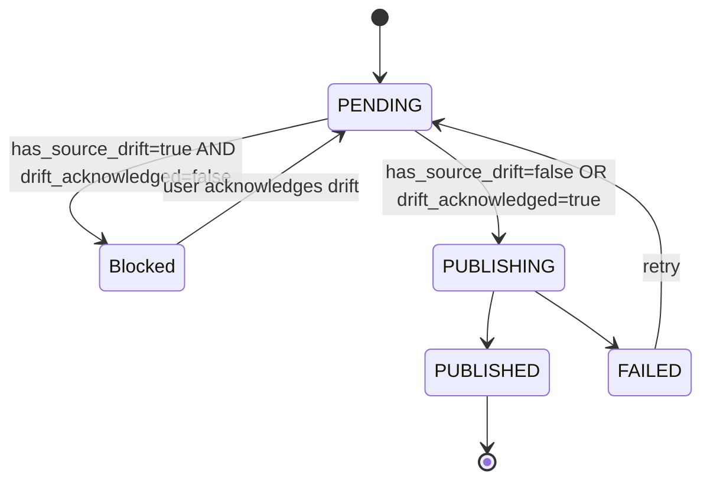

# New Data Quality Platform — Database Design v2 (READY FOR APPROVAL)

**Status:** v2 — incorporates 5 corrections requested against v1. Still design-only: no SQL scripts, no application code.
**Target engine assumption:** PostgreSQL 15+ (unchanged from v1). Portability notes unchanged — see Migration/Versioning Strategy.
**Global conventions:** unchanged from v1 (surrogate `UUID` PKs, `created_at`/`updated_at` pattern, actor columns nullable, enums as `CHECK`-constrained `TEXT`, no physical deletes on business-critical entities).

---

## CHANGELOG — What Changed From the 45-Table v1

| # | Area | Change |
|---|---|---|
| 1 | **Dataset keys** | Removed `datasets.primary_key_column` (single-column-only). Added new table **`dataset_key_columns`** (composite-key support). Added `datasets.key_strategy` (denormalized discriminator: `SINGLE_COLUMN` \| `COMPOSITE` \| `ROW_INDEX_FALLBACK`). Added an explicit **record_ref generation algorithm** (single-column / composite / no-PK cases). |
| 2 | **Rule assignment uniqueness** | Replaced the ambiguous `UNIQUE(rule_version_id, dataset_id, column_id, template_id)` on `rule_assignments` with an explicit `assignment_scope` discriminator column (`SINGLE_COLUMN` \| `DATASET_LEVEL` \| `CROSS_COLUMN`), a new `cross_column_key` column for cross-column dedup, a `CHECK` constraint tying scope to `column_id`/`cross_column_key` nullability, and **6 partial unique indexes** covering all scope × template combinations. |
| 3 | **Staging concurrency** | Added `validation_results.source_row_hash` (captured at validation time). Added `staging_records.source_row_hash_at_validation`, `source_row_hash_at_staging`, `source_drift_status`, `source_drift_fields` (drift detection at staging time). Added `staging_runs.has_source_drift` (rollup). Added `publish_runs.drift_acknowledged`, `drift_acknowledged_by`, `drift_acknowledged_at` (publish-time gate). |
| 4 | **AI provenance for semantic categories** | Added `columns.semantic_category_ai_suggestion_id` FK → `ai_suggestions(id)`, with a `CHECK` constraint enforcing it is set if and only if `semantic_category_source = 'AI'` — mirrors the existing `correction_suggestions.ai_suggestion_id` pattern. |
| 5 | **Staging run versioning** | Replaced `UNIQUE(review_run_id)` on `staging_runs` with `attempt_number` (sequential per review run) + `is_current` (boolean) + a **partial unique index** `(review_run_id) WHERE is_current` — supports multiple staging attempts per review run, all retained for audit, exactly one marked current. |

**Table count:** 45 → **46** (one new table: `dataset_key_columns`). No tables removed. All other 45 tables retained; several have column/index/constraint-level changes as detailed below.

---

## 1. IDENTITY *(unchanged from v1)*

### `roles`
| Column | Type | Null | Default | Notes |
|---|---|---|---|---|
| id | UUID | NOT NULL | gen_random_uuid() | PK |
| name | VARCHAR(100) | NOT NULL | — | |
| description | TEXT | NULL | — | |
| is_system_role | BOOLEAN | NOT NULL | false | |
| created_at | TIMESTAMPTZ | NOT NULL | now() | |
| updated_at | TIMESTAMPTZ | NULL | — | |

**Unique:** `(name)`

### `permissions`
| Column | Type | Null | Default | Notes |
|---|---|---|---|---|
| id | UUID | NOT NULL | gen_random_uuid() | PK |
| code | VARCHAR(150) | NOT NULL | — | |
| category | VARCHAR(100) | NOT NULL | — | |
| description | TEXT | NULL | — | |
| created_at | TIMESTAMPTZ | NOT NULL | now() | |

**Unique:** `(code)`

### `role_permissions`
| Column | Type | Null | Default | Notes |
|---|---|---|---|---|
| role_id | UUID | NOT NULL | — | PK(part), FK → `roles(id)` ON DELETE CASCADE |
| permission_id | UUID | NOT NULL | — | PK(part), FK → `permissions(id)` ON DELETE CASCADE |
| created_at | TIMESTAMPTZ | NOT NULL | now() | |

**Primary key:** `(role_id, permission_id)` · **Indexes:** `idx_role_permissions_permission_id (permission_id)`

### `users`
| Column | Type | Null | Default | Notes |
|---|---|---|---|---|
| id | UUID | NOT NULL | gen_random_uuid() | PK |
| email | VARCHAR(255) | NOT NULL | — | |
| username | VARCHAR(100) | NULL | — | |
| full_name | VARCHAR(255) | NULL | — | |
| password_hash | TEXT | NOT NULL | — | |
| status | VARCHAR(20) | NOT NULL | 'ACTIVE' | `ACTIVE`, `INACTIVE`, `LOCKED` |
| require_password_reset | BOOLEAN | NOT NULL | true | |
| last_login_at | TIMESTAMPTZ | NULL | — | |
| last_password_changed_at | TIMESTAMPTZ | NULL | — | |
| created_by | UUID | NULL | — | FK → `users(id)` |
| created_at | TIMESTAMPTZ | NOT NULL | now() | |
| updated_at | TIMESTAMPTZ | NULL | — | |

**Unique:** `(lower(email))`, `(username)` where not null · **Indexes:** `idx_users_status (status)`

### `user_roles`
| Column | Type | Null | Default | Notes |
|---|---|---|---|---|
| user_id | UUID | NOT NULL | — | PK(part), FK → `users(id)` ON DELETE CASCADE |
| role_id | UUID | NOT NULL | — | PK(part), FK → `roles(id)` ON DELETE CASCADE |
| assigned_by | UUID | NULL | — | FK → `users(id)` |
| assigned_at | TIMESTAMPTZ | NOT NULL | now() | |

**Primary key:** `(user_id, role_id)` · **Indexes:** `idx_user_roles_role_id (role_id)`

---

## 2. CONNECTIONS / METADATA *(datasets, columns, and dataset_key_columns changed — see ★)*

### `connection_types` *(unchanged)*
| Column | Type | Null | Default | Notes |
|---|---|---|---|---|
| id | UUID | NOT NULL | gen_random_uuid() | PK |
| code | VARCHAR(50) | NOT NULL | — | `SQL_SERVER`, `MYSQL`, `ORACLE`, `POSTGRESQL`, `SAP_HANA`, … |
| display_name | VARCHAR(100) | NOT NULL | — | |
| driver_module | VARCHAR(150) | NULL | — | |
| is_active | BOOLEAN | NOT NULL | true | |
| created_at | TIMESTAMPTZ | NOT NULL | now() | |

**Unique:** `(code)`

### `data_sources` *(unchanged)*
| Column | Type | Null | Default | Notes |
|---|---|---|---|---|
| id | UUID | NOT NULL | gen_random_uuid() | PK |
| name | VARCHAR(255) | NOT NULL | — | |
| description | TEXT | NULL | — | |
| owner_team | VARCHAR(255) | NULL | — | |
| business_domain | VARCHAR(100) | NULL | — | |
| is_active | BOOLEAN | NOT NULL | true | |
| created_by | UUID | NULL | — | FK → `users(id)` |
| created_at | TIMESTAMPTZ | NOT NULL | now() | |
| updated_at | TIMESTAMPTZ | NULL | — | |

**Unique:** `(name)`

### `connections` *(unchanged)*
| Column | Type | Null | Default | Notes |
|---|---|---|---|---|
| id | UUID | NOT NULL | gen_random_uuid() | PK |
| data_source_id | UUID | NOT NULL | — | FK → `data_sources(id)` |
| connection_type_id | UUID | NOT NULL | — | FK → `connection_types(id)` |
| name | VARCHAR(255) | NOT NULL | — | |
| environment | VARCHAR(20) | NOT NULL | 'UNKNOWN' | `PROD`, `STAGING`, `DEV`, `DR`, `UNKNOWN` |
| host | VARCHAR(255) | NOT NULL | — | |
| port | INTEGER | NOT NULL | — | |
| database_name | VARCHAR(255) | NULL | — | |
| service_name | VARCHAR(255) | NULL | — | |
| username | VARCHAR(255) | NOT NULL | — | |
| credential_ref | VARCHAR(255) | NOT NULL | — | opaque vault/secrets-manager reference — no password stored here |
| config | JSONB | NULL | '{}' | |
| status | VARCHAR(20) | NOT NULL | 'UNKNOWN' | `UNKNOWN`, `HEALTHY`, `WARNING`, `OFFLINE` |
| last_tested_at | TIMESTAMPTZ | NULL | — | |
| last_test_latency_ms | INTEGER | NULL | — | |
| is_active | BOOLEAN | NOT NULL | true | |
| created_by | UUID | NULL | — | FK → `users(id)` |
| created_at | TIMESTAMPTZ | NOT NULL | now() | |
| updated_at | TIMESTAMPTZ | NULL | — | |

**Unique:** `(data_source_id, name)` · **Indexes:** `idx_connections_status (status) WHERE is_active`, `idx_connections_data_source (data_source_id)`

### `schemas` *(unchanged)*
| Column | Type | Null | Default | Notes |
|---|---|---|---|---|
| id | UUID | NOT NULL | gen_random_uuid() | PK |
| connection_id | UUID | NOT NULL | — | FK → `connections(id)` |
| name | VARCHAR(255) | NOT NULL | — | |
| is_active | BOOLEAN | NOT NULL | true | |
| discovered_at | TIMESTAMPTZ | NOT NULL | now() | |
| created_at | TIMESTAMPTZ | NOT NULL | now() | |
| updated_at | TIMESTAMPTZ | NULL | — | |

**Unique:** `(connection_id, name)` · **Indexes:** `idx_schemas_connection_id (connection_id)`

### ★ `datasets` — CHANGED
**Purpose:** unchanged. **Change:** `primary_key_column` (single-column-only) removed; replaced by `dataset_key_columns` (below) plus a denormalized `key_strategy` discriminator for fast UI rendering and for validation/staging services to know which `record_ref` algorithm applies without an extra lookup.

| Column | Type | Null | Default | Notes |
|---|---|---|---|---|
| id | UUID | NOT NULL | gen_random_uuid() | PK |
| schema_id | UUID | NOT NULL | — | FK → `schemas(id)` |
| name | VARCHAR(255) | NOT NULL | — | |
| object_type | VARCHAR(20) | NOT NULL | 'TABLE' | `TABLE`, `VIEW` |
| ~~primary_key_column~~ | — | — | — | **REMOVED — see `dataset_key_columns`** |
| **key_strategy** | **VARCHAR(20)** | **NOT NULL** | **'ROW_INDEX_FALLBACK'** | **NEW — `SINGLE_COLUMN`, `COMPOSITE`, `ROW_INDEX_FALLBACK`; kept in sync with `dataset_key_columns` by the discovery/schema-analysis service (0 rows → `ROW_INDEX_FALLBACK`, 1 row → `SINGLE_COLUMN`, 2+ rows → `COMPOSITE`)** |
| row_count_estimate | BIGINT | NULL | — | |
| column_count | INTEGER | NULL | — | |
| last_profiled_at | TIMESTAMPTZ | NULL | — | |
| last_validated_at | TIMESTAMPTZ | NULL | — | |
| last_quality_score | NUMERIC(5,2) | NULL | — | |
| is_active | BOOLEAN | NOT NULL | true | |
| discovered_at | TIMESTAMPTZ | NOT NULL | now() | |
| created_at | TIMESTAMPTZ | NOT NULL | now() | |
| updated_at | TIMESTAMPTZ | NULL | — | |

**Unique:** `(schema_id, name)` · **Indexes:** `idx_datasets_schema_id (schema_id)`, `idx_datasets_last_quality_score (last_quality_score)`

### ★ `dataset_key_columns` — NEW
**Purpose:** Supports composite primary keys (and, generally, any 1+ column key) for a dataset, replacing the single-column `primary_key_column` field. Order matters (`ordinal`) because composite `record_ref` generation concatenates values in a fixed, deterministic sequence.

| Column | Type | Null | Default | Notes |
|---|---|---|---|---|
| dataset_id | UUID | NOT NULL | — | PK(part), FK → `datasets(id)` ON DELETE CASCADE |
| column_id | UUID | NOT NULL | — | PK(part), FK → `columns(id)` ON DELETE CASCADE |
| ordinal | INTEGER | NOT NULL | — | position within the composite key (0-based), determines concatenation order in `record_ref` |
| created_at | TIMESTAMPTZ | NOT NULL | now() | |

**Primary key:** `(dataset_id, column_id)`
**Unique:** `(dataset_id, ordinal)` — no two key columns can occupy the same position
**Indexes:** covered by PK; no additional index needed at this table's expected size (key columns per dataset are few)

### ★ `columns` — CHANGED
**Purpose:** unchanged. **Change:** added `semantic_category_ai_suggestion_id` (full AI provenance for semantic classification, correction #4).

| Column | Type | Null | Default | Notes |
|---|---|---|---|---|
| id | UUID | NOT NULL | gen_random_uuid() | PK |
| dataset_id | UUID | NOT NULL | — | FK → `datasets(id)` |
| name | VARCHAR(255) | NOT NULL | — | |
| ordinal_position | INTEGER | NOT NULL | — | |
| native_data_type | VARCHAR(100) | NULL | — | |
| normalized_data_type | VARCHAR(20) | NOT NULL | 'STRING' | `STRING`, `TEXT`, `INTEGER`, `DECIMAL`, `DATE`, `DATETIME`, `BOOLEAN` |
| max_length | INTEGER | NULL | — | |
| numeric_precision | INTEGER | NULL | — | |
| numeric_scale | INTEGER | NULL | — | |
| is_nullable | BOOLEAN | NOT NULL | true | |
| is_primary_key | BOOLEAN | NOT NULL | false | denormalized flag mirroring presence in `dataset_key_columns`, kept for fast column-list rendering |
| semantic_category | VARCHAR(50) | NULL | — | |
| semantic_category_source | VARCHAR(20) | NULL | — | `RULE_BASED`, `AI`, `HUMAN` |
| **semantic_category_ai_suggestion_id** | **UUID** | **NULL** | **—** | **NEW — FK → `ai_suggestions(id)`; the exact AI output (provider/model/prompt version) that produced `semantic_category` when `semantic_category_source = 'AI'`** |
| semantic_confidence | NUMERIC(4,3) | NULL | — | |
| discovered_at | TIMESTAMPTZ | NOT NULL | now() | |
| created_at | TIMESTAMPTZ | NOT NULL | now() | |
| updated_at | TIMESTAMPTZ | NULL | — | |

**Unique:** `(dataset_id, name)`
**Indexes:** `idx_columns_dataset_id (dataset_id)`, `idx_columns_semantic_category (semantic_category)`, `idx_columns_semantic_category_ai_suggestion_id (semantic_category_ai_suggestion_id)`
**CHECK (unchanged):** `semantic_category_source IS NOT NULL OR semantic_category IS NULL`
**CHECK (NEW):** `(semantic_category_source = 'AI') = (semantic_category_ai_suggestion_id IS NOT NULL)` — AI source requires the FK populated; any non-AI source (or no category at all) requires it NULL. Identical pattern to `correction_suggestions.ai_suggestion_id` in Section 6.

---

### ★ Record Reference (`record_ref`) Generation — NEW, explicit specification

`record_ref` is the stable string identifier that ties one logical source row together across `validation_results`, `issues`, and `staging_records`. It is generated by the **Validation Service** at validation time (and recomputed identically by the **Staging Service** when re-sampling) using the dataset's `key_strategy`:

**1. `SINGLE_COLUMN`** (`dataset_key_columns` has exactly 1 row):
`record_ref` = the stringified value of that one key column for the row, e.g. `"48213"` or `"WELL-00219"`. Direct, human-readable, matches the old app's behavior for the common case.

**2. `COMPOSITE`** (`dataset_key_columns` has 2+ rows):
`record_ref` = each key column's stringified value, taken in `ordinal` order, joined with the ASCII **Unit Separator** character (`U+001F`) — a non-printable delimiter effectively guaranteed not to appear in real business data, avoiding false collisions that a printable delimiter like `-` or `|` could cause. Example, 2-column key `(region_id=5, order_id=1002)` → `"5\u001F1002"`. NULL key-column values (should not normally occur for a true key, but handled defensively) are represented by a fixed sentinel token (`"\u0000NULL\u0000"`) rather than an empty string, so `(5, NULL)` and `(5, "")` never collide.
*Implementation note (non-binding):* for datasets with unusually wide or high-cardinality composite keys, services may additionally store a SHA-256 hash of this composite string for compact indexing, while still computing the human-readable form for display — this is an optional storage optimization, not a change to the logical `record_ref` value itself.

**3. `ROW_INDEX_FALLBACK`** (`dataset_key_columns` has 0 rows — no usable key detected or configured):
`record_ref` = `"ROWIDX:" || row_index` where `row_index` is the 0-based position of the row within that specific run's sampled result set. **Explicit limitation, surfaced in the UI wherever this strategy is used:** row-index-based references are only guaranteed stable *within a single run's sample* — they do **not** reliably identify "the same real-world row" across two separate validation runs or between validation and a later staging re-sample, because source row order is not guaranteed by the database absent an `ORDER BY`. The platform should visibly warn users profiling/validating a dataset with no configured key, and should treat any detected source drift on such a dataset as inherently lower-confidence (see Staging Concurrency, below) — recommending the user configure `dataset_key_columns` before relying on staging/publish for that dataset.

---

## 3. PROFILING *(unchanged from v1)*

### `profile_runs`
| Column | Type | Null | Default | Notes |
|---|---|---|---|---|
| id | UUID | NOT NULL | gen_random_uuid() | PK |
| dataset_id | UUID | NOT NULL | — | FK → `datasets(id)` |
| job_id | UUID | NULL | — | FK → `jobs(id)` |
| status | VARCHAR(20) | NOT NULL | 'QUEUED' | `QUEUED`, `RUNNING`, `COMPLETED`, `FAILED` |
| sample_size | INTEGER | NULL | — | |
| row_count | BIGINT | NULL | — | |
| quality_score | NUMERIC(5,2) | NULL | — | |
| null_percentage | NUMERIC(5,2) | NULL | — | |
| duplicate_percentage | NUMERIC(5,2) | NULL | — | |
| error_message | TEXT | NULL | — | |
| triggered_by | UUID | NULL | — | FK → `users(id)` |
| started_at | TIMESTAMPTZ | NULL | — | |
| completed_at | TIMESTAMPTZ | NULL | — | |
| created_at | TIMESTAMPTZ | NOT NULL | now() | |

**Indexes:** `idx_profile_runs_dataset_id_created_at (dataset_id, created_at DESC)`

### `column_profiles`
| Column | Type | Null | Default | Notes |
|---|---|---|---|---|
| id | UUID | NOT NULL | gen_random_uuid() | PK |
| profile_run_id | UUID | NOT NULL | — | FK → `profile_runs(id)` ON DELETE CASCADE |
| column_id | UUID | NOT NULL | — | FK → `columns(id)` |
| null_count | BIGINT | NULL | — | |
| null_percentage | NUMERIC(5,2) | NULL | — | |
| distinct_count | BIGINT | NULL | — | |
| distinct_percentage | NUMERIC(5,2) | NULL | — | |
| duplicate_count | BIGINT | NULL | — | |
| duplicate_percentage | NUMERIC(5,2) | NULL | — | |
| min_value | TEXT | NULL | — | |
| max_value | TEXT | NULL | — | |
| mean_value | NUMERIC | NULL | — | |
| median_value | NUMERIC | NULL | — | |
| mode_value | TEXT | NULL | — | |
| min_length | INTEGER | NULL | — | |
| max_length | INTEGER | NULL | — | |
| avg_length | NUMERIC(6,2) | NULL | — | |
| outlier_count | BIGINT | NULL | — | |
| pattern_summary | JSONB | NULL | — | |
| value_distribution | JSONB | NULL | — | |
| created_at | TIMESTAMPTZ | NOT NULL | now() | |

**Unique:** `(profile_run_id, column_id)` · **Indexes:** `idx_column_profiles_column_id (column_id)`

---

## 4. RULES *(rule_assignments changed — see ★; others unchanged)*

### `rules` *(unchanged)*
| Column | Type | Null | Default | Notes |
|---|---|---|---|---|
| id | UUID | NOT NULL | gen_random_uuid() | PK |
| name | VARCHAR(255) | NOT NULL | — | |
| description | TEXT | NULL | — | |
| category | VARCHAR(100) | NULL | — | |
| rule_type | VARCHAR(50) | NOT NULL | — | |
| origin | VARCHAR(20) | NOT NULL | 'BUILT_IN' | `BUILT_IN`, `CUSTOM`, `AI_RECOMMENDED` |
| status | VARCHAR(20) | NOT NULL | 'ACTIVE' | `ACTIVE`, `DISABLED`, `PENDING_REVIEW` |
| created_by | UUID | NULL | — | FK → `users(id)` |
| created_at | TIMESTAMPTZ | NOT NULL | now() | |
| updated_at | TIMESTAMPTZ | NULL | — | |

**Unique:** `(name)` · **Indexes:** `idx_rules_status (status)`, `idx_rules_origin (origin)`

### `rule_versions` *(unchanged)*
| Column | Type | Null | Default | Notes |
|---|---|---|---|---|
| id | UUID | NOT NULL | gen_random_uuid() | PK |
| rule_id | UUID | NOT NULL | — | FK → `rules(id)` |
| version_number | INTEGER | NOT NULL | — | |
| definition | JSONB | NOT NULL | — | |
| severity | VARCHAR(20) | NOT NULL | 'MEDIUM' | `CRITICAL`, `HIGH`, `MEDIUM`, `LOW` |
| error_message_template | TEXT | NULL | — | |
| is_current | BOOLEAN | NOT NULL | true | |
| created_by | UUID | NULL | — | FK → `users(id)` |
| created_at | TIMESTAMPTZ | NOT NULL | now() | |

**Unique:** `(rule_id, version_number)`; partial unique `(rule_id) WHERE is_current`
**Indexes:** `idx_rule_versions_rule_id (rule_id)`

### `validation_templates` *(unchanged)*
| Column | Type | Null | Default | Notes |
|---|---|---|---|---|
| id | UUID | NOT NULL | gen_random_uuid() | PK |
| dataset_id | UUID | NOT NULL | — | FK → `datasets(id)` |
| name | VARCHAR(255) | NOT NULL | — | |
| description | TEXT | NULL | — | |
| last_run_id | UUID | NULL | — | FK → `validation_runs(id)` |
| last_quality_score | NUMERIC(5,2) | NULL | — | |
| created_by | UUID | NULL | — | FK → `users(id)` |
| created_at | TIMESTAMPTZ | NOT NULL | now() | |
| updated_at | TIMESTAMPTZ | NULL | — | |

**Unique:** `(dataset_id, name)`

### ★ `rule_assignments` — CHANGED
**Purpose:** unchanged. **Change:** the old single ambiguous `UNIQUE(rule_version_id, dataset_id, column_id, template_id)` is **removed** (PostgreSQL treats every `NULL` as distinct, so it silently permitted duplicate dataset-level and cross-column assignments). Replaced with an explicit `assignment_scope` discriminator, a `cross_column_key` for deduplicating cross-column rules, and six scope-aware partial unique indexes.

| Column | Type | Null | Default | Notes |
|---|---|---|---|---|
| id | UUID | NOT NULL | gen_random_uuid() | PK |
| rule_version_id | UUID | NOT NULL | — | FK → `rule_versions(id)` |
| dataset_id | UUID | NOT NULL | — | FK → `datasets(id)` |
| **assignment_scope** | **VARCHAR(20)** | **NOT NULL** | **—** | **NEW — `SINGLE_COLUMN`, `DATASET_LEVEL`, `CROSS_COLUMN`; disambiguates the meaning of a NULL `column_id`, which otherwise conflates "dataset-level rule" and "cross-column rule" (both have no single target column)** |
| column_id | UUID | NULL | — | FK → `columns(id)` — set only when `assignment_scope = 'SINGLE_COLUMN'` |
| **cross_column_key** | **TEXT** | **NULL** | **—** | **NEW — set only when `assignment_scope = 'CROSS_COLUMN'`: a deterministic string built by the application from the *sorted* `column_id`s in the associated `rule_assignment_columns` rows (e.g. sorted UUIDs joined with a fixed delimiter), computed in the same transaction that inserts the child rows — lets the DB enforce "no duplicate cross-column rule over the same column set" without querying the child table** |
| template_id | UUID | NULL | — | FK → `validation_templates(id)` |
| is_enabled | BOOLEAN | NOT NULL | true | |
| paused_at | TIMESTAMPTZ | NULL | — | |
| assigned_by | UUID | NULL | — | FK → `users(id)` |
| assigned_at | TIMESTAMPTZ | NOT NULL | now() | |
| created_at | TIMESTAMPTZ | NOT NULL | now() | |
| updated_at | TIMESTAMPTZ | NULL | — | |

**CHECK constraints (NEW):**
- `assignment_scope = 'SINGLE_COLUMN' → column_id IS NOT NULL AND cross_column_key IS NULL`
- `assignment_scope = 'DATASET_LEVEL' → column_id IS NULL AND cross_column_key IS NULL`
- `assignment_scope = 'CROSS_COLUMN' → column_id IS NULL AND cross_column_key IS NOT NULL`

**Partial unique indexes (NEW — replaces the old single ambiguous constraint):**
| # | Index | Columns | Predicate |
|---|---|---|---|
| 1 | `uq_rule_assignments_single_no_template` | `(rule_version_id, dataset_id, column_id)` | `WHERE assignment_scope = 'SINGLE_COLUMN' AND template_id IS NULL` |
| 2 | `uq_rule_assignments_single_with_template` | `(rule_version_id, dataset_id, column_id, template_id)` | `WHERE assignment_scope = 'SINGLE_COLUMN' AND template_id IS NOT NULL` |
| 3 | `uq_rule_assignments_dataset_no_template` | `(rule_version_id, dataset_id)` | `WHERE assignment_scope = 'DATASET_LEVEL' AND template_id IS NULL` |
| 4 | `uq_rule_assignments_dataset_with_template` | `(rule_version_id, dataset_id, template_id)` | `WHERE assignment_scope = 'DATASET_LEVEL' AND template_id IS NOT NULL` |
| 5 | `uq_rule_assignments_cross_no_template` | `(rule_version_id, dataset_id, cross_column_key)` | `WHERE assignment_scope = 'CROSS_COLUMN' AND template_id IS NULL` |
| 6 | `uq_rule_assignments_cross_with_template` | `(rule_version_id, dataset_id, cross_column_key, template_id)` | `WHERE assignment_scope = 'CROSS_COLUMN' AND template_id IS NOT NULL` |

This correctly prevents duplicates in every requested case: a **single-column rule** can't be assigned twice to the same column (indexes 1–2); a **dataset-level rule** (e.g. "row count must be > 0") can't be assigned twice to the same dataset (indexes 3–4); a **cross-column rule** (e.g. latitude+longitude) can't be assigned twice over the same column set (indexes 5–6, via `cross_column_key`); and **template-based** assignments are tracked as a distinct namespace from ad hoc assignments in every scope (the "with_template" variants), so a template replay and a manually-configured one-off assignment of the same rule never collide.

**Other indexes:** `idx_rule_assignments_dataset_id (dataset_id) WHERE is_enabled`, `idx_rule_assignments_template_id (template_id)`, `idx_rule_assignments_scope (assignment_scope)`

### `rule_assignment_columns` *(unchanged in structure; now the source of truth `cross_column_key` is derived from)*
| Column | Type | Null | Default | Notes |
|---|---|---|---|---|
| rule_assignment_id | UUID | NOT NULL | — | PK(part), FK → `rule_assignments(id)` ON DELETE CASCADE |
| column_id | UUID | NOT NULL | — | PK(part), FK → `columns(id)` |
| ordinal | INTEGER | NOT NULL | 0 | |

**Primary key:** `(rule_assignment_id, column_id)`

---

## 5. VALIDATION *(validation_results changed — see ★; others unchanged)*

### `validation_runs` *(unchanged)*
| Column | Type | Null | Default | Notes |
|---|---|---|---|---|
| id | UUID | NOT NULL | gen_random_uuid() | PK |
| dataset_id | UUID | NOT NULL | — | FK → `datasets(id)` |
| template_id | UUID | NULL | — | FK → `validation_templates(id)` |
| job_id | UUID | NULL | — | FK → `jobs(id)` |
| status | VARCHAR(20) | NOT NULL | 'CREATED' | `CREATED`, `QUEUED`, `RUNNING`, `COMPLETED`, `FAILED`, `CANCELLED` |
| sample_size | INTEGER | NULL | — | |
| total_rows | BIGINT | NOT NULL | 0 | |
| passed_rows | BIGINT | NOT NULL | 0 | |
| warning_rows | BIGINT | NOT NULL | 0 | |
| failed_rows | BIGINT | NOT NULL | 0 | |
| quality_score | NUMERIC(5,2) | NULL | — | |
| error_message | TEXT | NULL | — | |
| triggered_by | UUID | NULL | — | FK → `users(id)` |
| started_at | TIMESTAMPTZ | NULL | — | |
| completed_at | TIMESTAMPTZ | NULL | — | |
| duration_ms | INTEGER | NULL | — | |
| created_at | TIMESTAMPTZ | NOT NULL | now() | |
| updated_at | TIMESTAMPTZ | NULL | — | |

**Indexes:** `idx_validation_runs_dataset_id_created_at (dataset_id, created_at DESC)`, `idx_validation_runs_status (status)`

### ★ `validation_results` — CHANGED
**Purpose:** unchanged. **Change:** added `source_row_hash`, the "as-validated" fingerprint that `staging_records` later compares against (Staging Concurrency, below).

| Column | Type | Null | Default | Notes |
|---|---|---|---|---|
| id | UUID | NOT NULL | gen_random_uuid() | PK |
| validation_run_id | UUID | NOT NULL | — | FK → `validation_runs(id)` ON DELETE CASCADE |
| record_ref | TEXT | NOT NULL | — | generated per the algorithm in Section 2 (type widened from `VARCHAR(255)` to `TEXT` to safely accommodate composite-key concatenation) |
| row_index | BIGINT | NOT NULL | — | |
| status | VARCHAR(10) | NOT NULL | — | `PASSED`, `WARNING`, `FAILED` |
| failure_count | INTEGER | NOT NULL | 0 | |
| **source_row_hash** | **TEXT** | **NOT NULL** | **—** | **NEW — SHA-256 over a canonical (stable column order, normalized value serialization) representation of every source column's value for this row, computed once during validation execution while the row is already in memory. This is the "fingerprint as of validation time."** |
| created_at | TIMESTAMPTZ | NOT NULL | now() | |

**Unique:** `(validation_run_id, row_index)`
**Indexes:** `idx_validation_results_run_status (validation_run_id, status)`, `idx_validation_results_record_ref (validation_run_id, record_ref)`

### `validation_failures` *(unchanged)*
| Column | Type | Null | Default | Notes |
|---|---|---|---|---|
| id | UUID | NOT NULL | gen_random_uuid() | PK |
| validation_result_id | UUID | NOT NULL | — | FK → `validation_results(id)` ON DELETE CASCADE |
| validation_run_id | UUID | NOT NULL | — | FK → `validation_runs(id)` ON DELETE CASCADE |
| rule_assignment_id | UUID | NOT NULL | — | FK → `rule_assignments(id)` |
| column_id | UUID | NULL | — | FK → `columns(id)` |
| severity | VARCHAR(20) | NOT NULL | — | `CRITICAL`, `HIGH`, `MEDIUM`, `LOW` |
| failed_value | TEXT | NULL | — | |
| expected_value | TEXT | NULL | — | |
| reason | TEXT | NULL | — | |
| created_at | TIMESTAMPTZ | NOT NULL | now() | |

**Indexes:** `idx_validation_failures_run_id (validation_run_id)`, `idx_validation_failures_column_id (column_id)`, `idx_validation_failures_rule_assignment_id (rule_assignment_id)`, `idx_validation_failures_severity (validation_run_id, severity)`

### `validation_metrics` *(unchanged)*
| Column | Type | Null | Default | Notes |
|---|---|---|---|---|
| id | UUID | NOT NULL | gen_random_uuid() | PK |
| validation_run_id | UUID | NOT NULL | — | FK → `validation_runs(id)` ON DELETE CASCADE |
| metric_name | VARCHAR(100) | NOT NULL | — | |
| metric_group | VARCHAR(255) | NULL | — | |
| metric_value | NUMERIC | NOT NULL | — | |
| created_at | TIMESTAMPTZ | NOT NULL | now() | |

**Unique:** `(validation_run_id, metric_name, metric_group)` · **Indexes:** `idx_validation_metrics_run_id (validation_run_id)`

---

## 6. REVIEW *(unchanged from v1 — correction_suggestions' existing ai_suggestion_id pattern is the template correction #4 replicates onto `columns`)*

### `review_runs`
| Column | Type | Null | Default | Notes |
|---|---|---|---|---|
| id | UUID | NOT NULL | gen_random_uuid() | PK |
| validation_run_id | UUID | NOT NULL | — | FK → `validation_runs(id)` |
| name | VARCHAR(255) | NULL | — | |
| status | VARCHAR(25) | NOT NULL | 'DRAFT' | `DRAFT`, `IN_REVIEW`, `READY_FOR_APPROVAL`, `ARCHIVED` |
| created_by | UUID | NULL | — | FK → `users(id)` |
| created_at | TIMESTAMPTZ | NOT NULL | now() | |
| updated_at | TIMESTAMPTZ | NULL | — | |
| archived_at | TIMESTAMPTZ | NULL | — | |

**Indexes:** `idx_review_runs_validation_run_id (validation_run_id)`, `idx_review_runs_status (status)`

### `issues`
| Column | Type | Null | Default | Notes |
|---|---|---|---|---|
| id | UUID | NOT NULL | gen_random_uuid() | PK |
| review_run_id | UUID | NOT NULL | — | FK → `review_runs(id)` ON DELETE CASCADE |
| validation_failure_id | UUID | NOT NULL | — | FK → `validation_failures(id)` |
| column_id | UUID | NULL | — | FK → `columns(id)` |
| record_ref | TEXT | NOT NULL | — | type widened to `TEXT` to match `validation_results.record_ref` |
| row_index | BIGINT | NOT NULL | — | |
| original_value | TEXT | NULL | — | |
| severity | VARCHAR(20) | NOT NULL | — | |
| status | VARCHAR(20) | NOT NULL | 'PENDING' | `PENDING`, `IN_PROGRESS`, `RESOLVED`, `SKIPPED` |
| assigned_reviewer_id | UUID | NULL | — | FK → `users(id)` |
| created_at | TIMESTAMPTZ | NOT NULL | now() | |
| updated_at | TIMESTAMPTZ | NULL | — | |

**Unique:** `(review_run_id, validation_failure_id)`
**Indexes:** `idx_issues_review_run_status (review_run_id, status)`, `idx_issues_column_id (column_id)`, `idx_issues_record_ref (review_run_id, record_ref)`

### `correction_suggestions`
| Column | Type | Null | Default | Notes |
|---|---|---|---|---|
| id | UUID | NOT NULL | gen_random_uuid() | PK |
| issue_id | UUID | NOT NULL | — | FK → `issues(id)` ON DELETE CASCADE |
| source | VARCHAR(15) | NOT NULL | — | `RULE_BASED`, `AI`, `HUMAN` |
| ai_suggestion_id | UUID | NULL | — | FK → `ai_suggestions(id)` |
| suggested_value | TEXT | NULL | — | |
| confidence | NUMERIC(4,3) | NULL | — | |
| fix_type | VARCHAR(50) | NULL | — | |
| reasoning | TEXT | NULL | — | |
| is_selected | BOOLEAN | NOT NULL | false | |
| selected_by | UUID | NULL | — | FK → `users(id)` |
| selected_at | TIMESTAMPTZ | NULL | — | |
| created_at | TIMESTAMPTZ | NOT NULL | now() | |

**CHECK:** `(source = 'AI') = (ai_suggestion_id IS NOT NULL)` — *(this is the exact pattern replicated onto `columns.semantic_category_ai_suggestion_id` for correction #4)*
**Indexes:** `idx_correction_suggestions_issue_id (issue_id)`, partial unique `(issue_id) WHERE is_selected`

### `corrections`
| Column | Type | Null | Default | Notes |
|---|---|---|---|---|
| id | UUID | NOT NULL | gen_random_uuid() | PK |
| issue_id | UUID | NOT NULL | — | FK → `issues(id)` ON DELETE CASCADE |
| correction_suggestion_id | UUID | NULL | — | FK → `correction_suggestions(id)` |
| final_value | TEXT | NULL | — | |
| value_source | VARCHAR(15) | NOT NULL | — | `RULE_BASED`, `AI`, `HUMAN` |
| status | VARCHAR(15) | NOT NULL | 'SUGGESTED' | `SUGGESTED`, `ACCEPTED`, `EDITED`, `REJECTED`, `SKIPPED` |
| decided_by | UUID | NULL | — | FK → `users(id)` |
| decided_at | TIMESTAMPTZ | NULL | — | |
| created_at | TIMESTAMPTZ | NOT NULL | now() | |
| updated_at | TIMESTAMPTZ | NULL | — | |

**Unique:** `(issue_id)` · **Indexes:** `idx_corrections_status (status)`

---

## 7. APPROVAL *(unchanged from v1)*

### `approval_requests`
| Column | Type | Null | Default | Notes |
|---|---|---|---|---|
| id | UUID | NOT NULL | gen_random_uuid() | PK |
| review_run_id | UUID | NOT NULL | — | FK → `review_runs(id)` |
| status | VARCHAR(20) | NOT NULL | 'PENDING' | `PENDING`, `APPROVED`, `REJECTED`, `PARTIALLY_APPROVED` |
| affected_issue_count | INTEGER | NOT NULL | 0 | |
| affected_record_count | INTEGER | NOT NULL | 0 | |
| requested_by | UUID | NULL | — | FK → `users(id)` |
| requested_at | TIMESTAMPTZ | NOT NULL | now() | |
| decided_at | TIMESTAMPTZ | NULL | — | |
| created_at | TIMESTAMPTZ | NOT NULL | now() | |
| updated_at | TIMESTAMPTZ | NULL | — | |

**Indexes:** `idx_approval_requests_review_run_id (review_run_id)`, `idx_approval_requests_status (status)`

### `approval_decisions`
| Column | Type | Null | Default | Notes |
|---|---|---|---|---|
| id | UUID | NOT NULL | gen_random_uuid() | PK |
| approval_request_id | UUID | NOT NULL | — | FK → `approval_requests(id)` ON DELETE CASCADE |
| decision | VARCHAR(10) | NOT NULL | — | `APPROVE`, `REJECT` |
| comment | TEXT | NULL | — | |
| decided_by | UUID | NOT NULL | — | FK → `users(id)` |
| decided_at | TIMESTAMPTZ | NOT NULL | now() | |
| created_at | TIMESTAMPTZ | NOT NULL | now() | |

**Indexes:** `idx_approval_decisions_request_id (approval_request_id)`

### `approval_decision_issues`
| Column | Type | Null | Default | Notes |
|---|---|---|---|---|
| approval_decision_id | UUID | NOT NULL | — | PK(part), FK → `approval_decisions(id)` ON DELETE CASCADE |
| issue_id | UUID | NOT NULL | — | PK(part), FK → `issues(id)` |

**Primary key:** `(approval_decision_id, issue_id)`

---

## 8. STAGING / PUBLISHING *(all three tables changed — see ★)*

### ★ `staging_runs` — CHANGED
**Purpose:** unchanged conceptually, but now explicitly supports **multiple attempts per review run**. **Changes:** `UNIQUE(review_run_id)` removed; added `attempt_number`, `is_current`, `has_source_drift`.

| Column | Type | Null | Default | Notes |
|---|---|---|---|---|
| id | UUID | NOT NULL | gen_random_uuid() | PK |
| review_run_id | UUID | NOT NULL | — | FK → `review_runs(id)` |
| dataset_id | UUID | NOT NULL | — | FK → `datasets(id)` |
| job_id | UUID | NULL | — | FK → `jobs(id)` |
| **attempt_number** | **INTEGER** | **NOT NULL** | **—** | **NEW — sequential per `review_run_id`, starting at 1; application computes `MAX(attempt_number)+1` within the insert transaction** |
| **is_current** | **BOOLEAN** | **NOT NULL** | **true** | **NEW — exactly one `true` row per `review_run_id` at any time; when a new attempt is inserted, the application flips the previous current row to `false` in the same transaction** |
| status | VARCHAR(15) | NOT NULL | 'NOT_STARTED' | `NOT_STARTED`, `BUILDING`, `READY`, `FAILED` |
| record_count | INTEGER | NOT NULL | 0 | |
| field_count | INTEGER | NOT NULL | 0 | |
| **has_source_drift** | **BOOLEAN** | **NOT NULL** | **false** | **NEW — rollup: true if any child `staging_records.source_drift_status <> 'UNCHANGED'` for this attempt; set by the staging build process on completion** |
| error_message | TEXT | NULL | — | |
| created_by | UUID | NULL | — | FK → `users(id)` |
| started_at | TIMESTAMPTZ | NULL | — | |
| completed_at | TIMESTAMPTZ | NULL | — | |
| created_at | TIMESTAMPTZ | NOT NULL | now() | |
| updated_at | TIMESTAMPTZ | NULL | — | |

**Unique:** `(review_run_id, attempt_number)` — no duplicate attempt numbers per review run
**Partial unique index:** `uq_staging_runs_current (review_run_id) WHERE is_current` — enforces exactly one current attempt per review run (replaces the old, overly-restrictive `UNIQUE(review_run_id)`)
**Indexes:** `idx_staging_runs_dataset_id (dataset_id)`, `idx_staging_runs_status (status)`, `idx_staging_runs_review_run_id (review_run_id, attempt_number DESC)`

**Multi-attempt example (matches your requested pattern):**
```
Review Run #42
 ├── Staging Attempt 1  (attempt_number=1, status=FAILED,  is_current=false)
 ├── Staging Attempt 2  (attempt_number=2, status=FAILED,  is_current=false)
 └── Staging Attempt 3  (attempt_number=3, status=READY,   is_current=true)
```
All three rows — and their associated `staging_records` — are retained indefinitely for audit; only attempt 3 is eligible to be referenced by a `publish_runs` row (an application-level rule, since "only the current, READY attempt is publishable" is a cross-cutting invariant not expressible as a single-table `CHECK`).

### ★ `staging_records` — CHANGED
**Purpose:** unchanged. **Changes:** added the source-drift detection fields (Staging Concurrency, below).

| Column | Type | Null | Default | Notes |
|---|---|---|---|---|
| id | UUID | NOT NULL | gen_random_uuid() | PK |
| staging_run_id | UUID | NOT NULL | — | FK → `staging_runs(id)` ON DELETE CASCADE |
| record_ref | TEXT | NOT NULL | — | |
| row_snapshot | JSONB | NOT NULL | — | |
| corrected_fields | JSONB | NOT NULL | '[]' | |
| **source_row_hash_at_validation** | **TEXT** | **NOT NULL** | **—** | **NEW — copied from the originating `validation_results.source_row_hash` for this `record_ref`, denormalized to avoid a join on every staging build/read** |
| **source_row_hash_at_staging** | **TEXT** | **NULL** | **—** | **NEW — freshly computed (same algorithm) from the source row as re-sampled at staging build time; NULL if the record could not be found in the source at all** |
| **source_drift_status** | **VARCHAR(20)** | **NOT NULL** | **'UNCHANGED'** | **NEW — `UNCHANGED`, `VALUE_CHANGED`, `RECORD_NOT_FOUND`; set by comparing the two hash columns above** |
| **source_drift_fields** | **JSONB** | **NULL** | **—** | **NEW — populated only when `source_drift_status = 'VALUE_CHANGED'`: array of column names whose value differs between the two snapshots, computed cheaply since both full rows are already in memory during the staging build** |
| created_at | TIMESTAMPTZ | NOT NULL | now() | |

**Unique:** `(staging_run_id, record_ref)`
**Indexes:** `idx_staging_records_staging_run_id (staging_run_id)`, `idx_staging_records_drift (staging_run_id, source_drift_status) WHERE source_drift_status <> 'UNCHANGED'`
**Partitioning (scale):** unchanged recommendation — range/hash-partition by `staging_run_id` or `created_at`.

### ★ `publish_runs` — CHANGED
**Purpose:** unchanged. **Changes:** added the drift-acknowledgement gate (Staging Concurrency, below) so a `staging_runs.has_source_drift = true` attempt cannot silently publish.

| Column | Type | Null | Default | Notes |
|---|---|---|---|---|
| id | UUID | NOT NULL | gen_random_uuid() | PK |
| staging_run_id | UUID | NOT NULL | — | FK → `staging_runs(id)` — application enforces this references a `READY`, `is_current = true` attempt |
| status | VARCHAR(15) | NOT NULL | 'PENDING' | `PENDING`, `PUBLISHING`, `PUBLISHED`, `FAILED` |
| target_type | VARCHAR(30) | NOT NULL | — | `WAREHOUSE_TABLE`, `SOURCE_TABLE`, `FILE_EXPORT`, `API` |
| target_reference | TEXT | NULL | — | |
| published_record_count | INTEGER | NULL | — | |
| **drift_acknowledged** | **BOOLEAN** | **NOT NULL** | **false** | **NEW — must be `true` before `status` can advance past `PENDING` whenever the referenced `staging_runs.has_source_drift = true`; if `has_source_drift = false`, this field is irrelevant (publish proceeds normally)** |
| **drift_acknowledged_by** | **UUID** | **NULL** | **—** | **NEW — FK → `users(id)`; who explicitly accepted the risk of publishing against detected source drift** |
| **drift_acknowledged_at** | **TIMESTAMPTZ** | **NULL** | **—** | **NEW** |
| error_message | TEXT | NULL | — | |
| published_by | UUID | NULL | — | FK → `users(id)` |
| started_at | TIMESTAMPTZ | NULL | — | |
| completed_at | TIMESTAMPTZ | NULL | — | |
| created_at | TIMESTAMPTZ | NOT NULL | now() | |
| updated_at | TIMESTAMPTZ | NULL | — | |

**Indexes:** `idx_publish_runs_staging_run_id (staging_run_id)`, `idx_publish_runs_status (status)`

---

### ★ Staging Concurrency / Source-Drift Detection — NEW, explicit specification

**Problem:** a row can be validated, reviewed, and approved — and then, before staging/publish actually runs, the *source* row can change underneath it (another system updates it, a batch job overwrites it). Silently staging/publishing the old approved correction on top of now-stale source data would produce an incorrect, unflagged result.

**Where the fingerprint is captured (validation time):**
`validation_results.source_row_hash` — a SHA-256 hash computed once, at validation execution time, over a canonical serialization (stable column order, normalized value formatting) of the *entire* source row (not just the columns a rule happened to touch — a change to *any* column counts as drift). Computed while the row is already loaded for rule evaluation, so effectively free.

**Where the fingerprint is re-checked (staging time):**
When the **Staging Service** builds a `staging_records` row, it re-samples the current source row for that `record_ref` (as it already must, to assemble the full corrected snapshot) and computes the identical hash over that freshly-read row → `staging_records.source_row_hash_at_staging`. It also copies the original validation-time hash into `staging_records.source_row_hash_at_validation` for a self-contained comparison record (no join needed later). The two are compared:
- **Equal** → `source_drift_status = 'UNCHANGED'`.
- **Different** → `source_drift_status = 'VALUE_CHANGED'`, and `source_drift_fields` is populated with the specific column names that differ (cheap, since both full rows are already in memory).
- **Source row no longer found** (deleted, or — for `ROW_INDEX_FALLBACK` datasets — index no longer resolves to the same logical row) → `source_drift_status = 'RECORD_NOT_FOUND'`.

**Where the block is enforced (publish time):**
The staging build rolls the per-record result up to `staging_runs.has_source_drift` (true if *any* record in the attempt drifted). `publish_runs.status` is application-gated: it cannot progress from `PENDING` to `PUBLISHING` while `staging_runs.has_source_drift = true` **unless** `publish_runs.drift_acknowledged = true` (set only by an explicit user action, recorded with `drift_acknowledged_by`/`_at`). This turns "silently publish stale corrections" into "explicitly, auditably choose to publish anyway" — the UI (Staging/Publish screen, per the approved Stitch design) should surface exactly which records drifted and why before allowing that acknowledgement.

**Why not re-run validation instead of just detecting drift?** Out of scope for the database design itself (an application/product decision), but the schema supports either future direction without change: a "drift detected → require re-validation before staging" policy would simply mean the application refuses to set `staging_runs.status = 'READY'` at all when drift is found, rather than allowing the acknowledge-and-proceed path — both behaviors read the same `source_drift_status`/`has_source_drift` fields.

---

## 9. LINEAGE *(unchanged, entity-type enum extended to include `DATASET_KEY_COLUMN` optionally — see note)*

### `lineage_records`
| Column | Type | Null | Default | Notes |
|---|---|---|---|---|
| id | UUID | NOT NULL | gen_random_uuid() | PK |
| parent_entity_type | VARCHAR(30) | NOT NULL | — | `DATA_SOURCE`, `CONNECTION`, `SCHEMA`, `DATASET`, `COLUMN`, `RULE`, `VALIDATION_RUN`, `ISSUE`, `CORRECTION`, `APPROVAL_REQUEST`, `STAGING_RUN`, `PUBLISH_RUN` |
| parent_entity_id | UUID | NOT NULL | — | |
| child_entity_type | VARCHAR(30) | NOT NULL | — | same enum |
| child_entity_id | UUID | NOT NULL | — | |
| relationship_type | VARCHAR(30) | NOT NULL | — | `DERIVED_FROM`, `VALIDATED_BY`, `CORRECTED_BY`, `APPROVED_BY`, `STAGED_INTO`, `PUBLISHED_TO` |
| created_at | TIMESTAMPTZ | NOT NULL | now() | |

**Unique:** `(parent_entity_type, parent_entity_id, child_entity_type, child_entity_id, relationship_type)`
**Indexes:** `idx_lineage_parent (parent_entity_type, parent_entity_id)`, `idx_lineage_child (child_entity_type, child_entity_id)`
*Note: `dataset_key_columns` does not need its own lineage entity type — it is structural metadata about a `DATASET`, not a pipeline stage, and is fully covered by the `DATASET`/`COLUMN` entity types already in the enum.*

---

## 10. AUDIT *(unchanged)*

### `audit_events`
| Column | Type | Null | Default | Notes |
|---|---|---|---|---|
| id | UUID | NOT NULL | gen_random_uuid() | PK |
| actor_id | UUID | NULL | — | FK → `users(id)` |
| actor_type | VARCHAR(10) | NOT NULL | 'USER' | `USER`, `SYSTEM`, `AI` |
| action | VARCHAR(100) | NOT NULL | — | |
| entity_type | VARCHAR(30) | NOT NULL | — | |
| entity_id | UUID | NOT NULL | — | |
| before_value | JSONB | NULL | — | |
| after_value | JSONB | NULL | — | |
| metadata | JSONB | NULL | — | |
| created_at | TIMESTAMPTZ | NOT NULL | now() | |

**Indexes:** `idx_audit_events_entity (entity_type, entity_id, created_at DESC)`, `idx_audit_events_actor (actor_id, created_at DESC)`, `idx_audit_events_action (action)`, `idx_audit_events_created_at (created_at)`
**Immutability:** insert-only for application service accounts (unchanged).

---

## 11. AI *(unchanged in structure; `ai_suggestions` now additionally referenced from `columns`, not just `correction_suggestions`)*

### `ai_prompt_versions`
| Column | Type | Null | Default | Notes |
|---|---|---|---|---|
| id | UUID | NOT NULL | gen_random_uuid() | PK |
| prompt_key | VARCHAR(100) | NOT NULL | — | |
| version_number | INTEGER | NOT NULL | — | |
| template | TEXT | NOT NULL | — | |
| default_model | VARCHAR(100) | NULL | — | |
| is_active | BOOLEAN | NOT NULL | true | |
| created_by | UUID | NULL | — | FK → `users(id)` |
| created_at | TIMESTAMPTZ | NOT NULL | now() | |

**Unique:** `(prompt_key, version_number)` · **Indexes:** partial `idx_ai_prompt_versions_active (prompt_key) WHERE is_active`

### `ai_conversations`
| Column | Type | Null | Default | Notes |
|---|---|---|---|---|
| id | UUID | NOT NULL | gen_random_uuid() | PK |
| user_id | UUID | NOT NULL | — | FK → `users(id)` |
| title | VARCHAR(255) | NULL | — | |
| context | JSONB | NULL | — | |
| status | VARCHAR(15) | NOT NULL | 'ACTIVE' | `ACTIVE`, `CLOSED` |
| created_at | TIMESTAMPTZ | NOT NULL | now() | |
| updated_at | TIMESTAMPTZ | NULL | — | |

**Indexes:** `idx_ai_conversations_user_id (user_id, updated_at DESC)`

### `ai_messages`
| Column | Type | Null | Default | Notes |
|---|---|---|---|---|
| id | UUID | NOT NULL | gen_random_uuid() | PK |
| conversation_id | UUID | NOT NULL | — | FK → `ai_conversations(id)` ON DELETE CASCADE |
| role | VARCHAR(15) | NOT NULL | — | `USER`, `ASSISTANT`, `SYSTEM_NOTE` |
| content | TEXT | NOT NULL | — | |
| tool_calls | JSONB | NULL | — | |
| created_at | TIMESTAMPTZ | NOT NULL | now() | |

**Indexes:** `idx_ai_messages_conversation_id (conversation_id, created_at)`

### `ai_suggestions`
| Column | Type | Null | Default | Notes |
|---|---|---|---|---|
| id | UUID | NOT NULL | gen_random_uuid() | PK |
| suggestion_type | VARCHAR(30) | NOT NULL | — | `CORRECTION`, `RULE_RECOMMENDATION`, `SEMANTIC_CATEGORY`, `EXPLANATION`, `RUN_SUMMARY`, `CLUSTER`, `PRIORITIZATION` |
| source_context_type | VARCHAR(30) | NOT NULL | — | `ISSUE`, `COLUMN`, `DATASET`, `VALIDATION_RUN`, `REVIEW_RUN` |
| source_context_id | UUID | NOT NULL | — | |
| content | JSONB | NOT NULL | — | |
| confidence | NUMERIC(4,3) | NULL | — | |
| provider | VARCHAR(50) | NOT NULL | — | |
| model | VARCHAR(100) | NOT NULL | — | |
| prompt_version_id | UUID | NOT NULL | — | FK → `ai_prompt_versions(id)` |
| conversation_id | UUID | NULL | — | FK → `ai_conversations(id)` |
| requested_by | UUID | NULL | — | FK → `users(id)` |
| status | VARCHAR(15) | NOT NULL | 'PROPOSED' | `PROPOSED`, `ACCEPTED`, `REJECTED`, `EXPIRED` |
| response_metadata | JSONB | NULL | — | |
| created_at | TIMESTAMPTZ | NOT NULL | now() | |

**Indexes:** `idx_ai_suggestions_context (source_context_type, source_context_id)`, `idx_ai_suggestions_type_status (suggestion_type, status)`
*Note: `source_context_type = 'COLUMN'` rows are exactly the ones `columns.semantic_category_ai_suggestion_id` (Section 2) points back to for `SEMANTIC_CATEGORY`-type suggestions.*

### `ai_usage_logs`
| Column | Type | Null | Default | Notes |
|---|---|---|---|---|
| id | UUID | NOT NULL | gen_random_uuid() | PK |
| conversation_id | UUID | NULL | — | FK → `ai_conversations(id)` |
| ai_suggestion_id | UUID | NULL | — | FK → `ai_suggestions(id)` |
| user_id | UUID | NOT NULL | — | FK → `users(id)` |
| provider | VARCHAR(50) | NOT NULL | — | |
| model | VARCHAR(100) | NOT NULL | — | |
| prompt_version_id | UUID | NULL | — | FK → `ai_prompt_versions(id)` |
| input_tokens | INTEGER | NULL | — | |
| output_tokens | INTEGER | NULL | — | |
| latency_ms | INTEGER | NULL | — | |
| cost_estimate | NUMERIC(10,4) | NULL | — | |
| created_at | TIMESTAMPTZ | NOT NULL | now() | |

**Indexes:** `idx_ai_usage_logs_user_id_created_at (user_id, created_at)`, `idx_ai_usage_logs_created_at (created_at)`

---

## 12. JOBS *(unchanged)*

### `jobs`
| Column | Type | Null | Default | Notes |
|---|---|---|---|---|
| id | UUID | NOT NULL | gen_random_uuid() | PK |
| job_type | VARCHAR(30) | NOT NULL | — | `PROFILE_RUN`, `VALIDATION_RUN`, `STAGING_BUILD`, `PUBLISH`, `EXPORT` |
| entity_type | VARCHAR(30) | NOT NULL | — | |
| entity_id | UUID | NOT NULL | — | |
| status | VARCHAR(15) | NOT NULL | 'QUEUED' | `QUEUED`, `RUNNING`, `COMPLETED`, `FAILED`, `CANCELLED` |
| progress_percentage | SMALLINT | NULL | — | |
| error_message | TEXT | NULL | — | |
| queued_at | TIMESTAMPTZ | NOT NULL | now() | |
| started_at | TIMESTAMPTZ | NULL | — | |
| completed_at | TIMESTAMPTZ | NULL | — | |
| created_by | UUID | NULL | — | FK → `users(id)` |
| created_at | TIMESTAMPTZ | NOT NULL | now() | |
| updated_at | TIMESTAMPTZ | NULL | — | |

**Indexes:** `idx_jobs_entity (entity_type, entity_id)`, `idx_jobs_status (status)`, `idx_jobs_job_type_status (job_type, status)`

---

## Relationship Explanation (updated)

- **Identity → everything**: unchanged from v1.
- **Metadata hierarchy**: `data_sources` (1) → `connections` (N) → `schemas` (N) → `datasets` (N) → `columns` (N), **now with `datasets` (1) → `dataset_key_columns` (N) defining the composite key** used to compute `record_ref` consistently across validation, review, and staging.
- **Rules**: unchanged shape, but `rule_assignments` now carries an explicit `assignment_scope` that determines *which* partial unique index applies and how `record`-level failures relate back to either a single `column_id` or a `rule_assignment_columns` set (for `CROSS_COLUMN`) or neither (for `DATASET_LEVEL`).
- **Validation**: unchanged shape; `validation_results` now carries the row's `source_row_hash` fingerprint that `staging_records` later compares against — this is the one new cross-stage dependency introduced by correction #3.
- **Review**: unchanged.
- **Approval**: unchanged.
- **Staging/Publish**: `review_runs` (1) → `staging_runs` (**N, versioned attempts**, exactly one `is_current`) → `staging_records` (N per attempt, each carrying its own drift-detection result) → `publish_runs` (N, application-restricted to reference only a `READY`/`is_current` attempt, and gated by `drift_acknowledged` whenever that attempt's `has_source_drift = true`).
- **Lineage**: unchanged — still a parallel generic graph over the same entities; `dataset_key_columns` is intentionally not a separate lineage node (see note in Section 9).
- **Audit**: unchanged.
- **AI**: unchanged in structure; now has **two** feature-table consumers of `ai_suggestions` (`correction_suggestions.ai_suggestion_id` and the new `columns.semantic_category_ai_suggestion_id`), both following the identical "source enum + conditional FK + CHECK constraint" pattern — establishing that pattern as the standard way any *future* AI-touched field should be modeled too.
- **Jobs**: unchanged.

---

## Complete ER Diagram (Mermaid) — v2

```mermaid
erDiagram
    ROLES ||--o{ ROLE_PERMISSIONS : has
    PERMISSIONS ||--o{ ROLE_PERMISSIONS : granted_in
    USERS ||--o{ USER_ROLES : has
    ROLES ||--o{ USER_ROLES : assigned_to

    DATA_SOURCES ||--o{ CONNECTIONS : "accessed via"
    CONNECTION_TYPES ||--o{ CONNECTIONS : "typed as"
    CONNECTIONS ||--o{ SCHEMAS : discovers
    SCHEMAS ||--o{ DATASETS : discovers
    DATASETS ||--o{ COLUMNS : discovers
    DATASETS ||--o{ DATASET_KEY_COLUMNS : "keyed by"
    COLUMNS ||--o{ DATASET_KEY_COLUMNS : "part of key"
    AI_SUGGESTIONS ||--o{ COLUMNS : "classified by (semantic_category)"

    DATASETS ||--o{ PROFILE_RUNS : "profiled by"
    PROFILE_RUNS ||--o{ COLUMN_PROFILES : produces
    COLUMNS ||--o{ COLUMN_PROFILES : "profiled as"

    RULES ||--o{ RULE_VERSIONS : versioned_as
    RULE_VERSIONS ||--o{ RULE_ASSIGNMENTS : activated_as
    DATASETS ||--o{ RULE_ASSIGNMENTS : "targeted by"
    COLUMNS ||--o{ RULE_ASSIGNMENTS : "targeted by (single-column)"
    RULE_ASSIGNMENTS ||--o{ RULE_ASSIGNMENT_COLUMNS : "covers (cross-column)"
    COLUMNS ||--o{ RULE_ASSIGNMENT_COLUMNS : "covered by"
    DATASETS ||--o{ VALIDATION_TEMPLATES : "saved config for"
    VALIDATION_TEMPLATES ||--o{ RULE_ASSIGNMENTS : groups

    DATASETS ||--o{ VALIDATION_RUNS : "validated by"
    VALIDATION_TEMPLATES ||--o{ VALIDATION_RUNS : replays
    VALIDATION_RUNS ||--o{ VALIDATION_RESULTS : produces
    VALIDATION_RESULTS ||--o{ VALIDATION_FAILURES : produces
    RULE_ASSIGNMENTS ||--o{ VALIDATION_FAILURES : "detected by"
    VALIDATION_RUNS ||--o{ VALIDATION_METRICS : summarized_by

    VALIDATION_RUNS ||--o{ REVIEW_RUNS : "sent to"
    REVIEW_RUNS ||--o{ ISSUES : contains
    VALIDATION_FAILURES ||--o| ISSUES : "carried into"
    ISSUES ||--o{ CORRECTION_SUGGESTIONS : "candidates for"
    ISSUES ||--|| CORRECTIONS : "resolved as"
    CORRECTION_SUGGESTIONS ||--o| CORRECTIONS : "basis of"
    AI_SUGGESTIONS ||--o{ CORRECTION_SUGGESTIONS : "detail for (AI source)"

    REVIEW_RUNS ||--o{ APPROVAL_REQUESTS : requests
    APPROVAL_REQUESTS ||--o{ APPROVAL_DECISIONS : decided_by
    APPROVAL_DECISIONS ||--o{ APPROVAL_DECISION_ISSUES : covers
    ISSUES ||--o{ APPROVAL_DECISION_ISSUES : "covered by"

    REVIEW_RUNS ||--o{ STAGING_RUNS : "materialized as (versioned attempts)"
    DATASETS ||--o{ STAGING_RUNS : "staged from"
    STAGING_RUNS ||--o{ STAGING_RECORDS : contains
    STAGING_RUNS ||--o{ PUBLISH_RUNS : "published via (current+READY only)"

    USERS ||--o{ AI_CONVERSATIONS : starts
    AI_CONVERSATIONS ||--o{ AI_MESSAGES : contains
    AI_PROMPT_VERSIONS ||--o{ AI_SUGGESTIONS : "generated with"
    AI_CONVERSATIONS ||--o{ AI_SUGGESTIONS : "produced in"
    AI_SUGGESTIONS ||--o{ AI_USAGE_LOGS : logged_by

    JOBS ||--o| PROFILE_RUNS : tracks
    JOBS ||--o| VALIDATION_RUNS : tracks
    JOBS ||--o| STAGING_RUNS : tracks

    USERS {
        uuid id PK
        text email
        text status
    }
    DATA_SOURCES {
        uuid id PK
        text name
    }
    CONNECTIONS {
        uuid id PK
        uuid data_source_id FK
        uuid connection_type_id FK
        text status
    }
    SCHEMAS {
        uuid id PK
        uuid connection_id FK
    }
    DATASETS {
        uuid id PK
        uuid schema_id FK
        text key_strategy "NEW"
    }
    DATASET_KEY_COLUMNS {
        uuid dataset_id PK_FK "NEW TABLE"
        uuid column_id PK_FK
        int ordinal
    }
    COLUMNS {
        uuid id PK
        uuid dataset_id FK
        text semantic_category_source
        uuid semantic_category_ai_suggestion_id FK "NEW"
    }
    PROFILE_RUNS {
        uuid id PK
        uuid dataset_id FK
        text status
    }
    RULES {
        uuid id PK
        text origin
        text status
    }
    RULE_VERSIONS {
        uuid id PK
        uuid rule_id FK
        bool is_current
    }
    RULE_ASSIGNMENTS {
        uuid id PK
        uuid rule_version_id FK
        uuid dataset_id FK
        uuid column_id FK
        text assignment_scope "NEW"
        text cross_column_key "NEW"
    }
    VALIDATION_TEMPLATES {
        uuid id PK
        uuid dataset_id FK
    }
    VALIDATION_RUNS {
        uuid id PK
        uuid dataset_id FK
        text status
    }
    VALIDATION_RESULTS {
        uuid id PK
        uuid validation_run_id FK
        text record_ref
        text source_row_hash "NEW"
    }
    VALIDATION_FAILURES {
        uuid id PK
        uuid validation_result_id FK
        uuid rule_assignment_id FK
        text severity
    }
    REVIEW_RUNS {
        uuid id PK
        uuid validation_run_id FK
        text status
    }
    ISSUES {
        uuid id PK
        uuid review_run_id FK
        uuid validation_failure_id FK
        text status
    }
    CORRECTION_SUGGESTIONS {
        uuid id PK
        uuid issue_id FK
        text source
        uuid ai_suggestion_id FK
    }
    CORRECTIONS {
        uuid id PK
        uuid issue_id FK
        text value_source
        text status
    }
    APPROVAL_REQUESTS {
        uuid id PK
        uuid review_run_id FK
        text status
    }
    APPROVAL_DECISIONS {
        uuid id PK
        uuid approval_request_id FK
        text decision
    }
    STAGING_RUNS {
        uuid id PK
        uuid review_run_id FK
        int attempt_number "NEW"
        bool is_current "NEW"
        bool has_source_drift "NEW"
        text status
    }
    STAGING_RECORDS {
        uuid id PK
        uuid staging_run_id FK
        text record_ref
        text source_drift_status "NEW"
    }
    PUBLISH_RUNS {
        uuid id PK
        uuid staging_run_id FK
        bool drift_acknowledged "NEW"
        text status
    }
    AI_SUGGESTIONS {
        uuid id PK
        text suggestion_type
        text provider
        text model
        uuid prompt_version_id FK
    }
    JOBS {
        uuid id PK
        text job_type
        text status
    }
```

---

## State Machines — updated where affected

### Validation Run *(unchanged)*


### Review Run *(unchanged)*


### Correction *(unchanged)*


### Approval Request *(unchanged)*


### ★ Staging Run — per-attempt state machine, UPDATED with multi-attempt semantics
Each `staging_runs` row is itself a simple, terminal-ending state machine (unchanged at the single-row level):

**What's new is the relationship *between* rows**, not the states within one: a "rebuild" or "retry" never mutates a `FAILED` or `READY` row back to `BUILDING` — it always **inserts a new `staging_runs` row** with `attempt_number = previous_max + 1`, sets that new row's `is_current = true`, and flips the prior current row's `is_current = false` in the same transaction:


### ★ Publish Run — UPDATED with the drift-acknowledgement gate

`Blocked` is a UI/application-level holding state (not a stored `status` value — `publish_runs.status` remains `PENDING` throughout) represented here to make the gate's behavior explicit: the transition out of `PENDING` into `PUBLISHING` requires either no drift or an explicit acknowledgement, never happening implicitly.

---

## Index Strategy — updated additions

All v1 index-strategy principles remain (FK-supporting indexes, partial indexes on active status, composite recency indexes, `record_ref` indexed everywhere it's a join key, selective JSONB GIN indexes, partial-unique "only one current X" pattern). **New in v2:**
- `dataset_key_columns` needs no index beyond its own PK/unique — it's small (a handful of rows per dataset) and always queried by `dataset_id`, already the leading column of the PK.
- `rule_assignments` now needs **6 partial unique indexes** instead of 1 ambiguous one (Section 4) — each is small and targeted (only rows matching its specific scope/template predicate), so the total overhead is comparable to a single broader index despite the count.
- `staging_records.idx_staging_records_drift` is a **partial** index (`WHERE source_drift_status <> 'UNCHANGED'`) specifically so the common case (no drift) never bloats the index — it stays small and fast for exactly the query the Staging/Publish screen needs ("show me the drifted records").
- `columns.idx_columns_semantic_category_ai_suggestion_id` supports the reverse lookup ("which columns did this AI suggestion classify") used by AI-usage auditing and the AI Insights screen.
- The `uq_staging_runs_current` partial unique index is now the *only* place staging-run currency is enforced at the DB level — the application must always update it transactionally with the insert of a new attempt (documented as a required transactional pattern, not just a suggestion).

---

## Final Table List (46 tables) — recalculated

**Identity (5):** `users`, `roles`, `permissions`, `user_roles`, `role_permissions`
**Connections/Metadata (7, +1):** `data_sources`, `connection_types`, `connections`, `schemas`, `datasets`, `columns`, **`dataset_key_columns` (NEW)**
**Profiling (2):** `profile_runs`, `column_profiles`
**Rules (5):** `rules`, `rule_versions`, `validation_templates`, `rule_assignments`, `rule_assignment_columns`
**Validation (4):** `validation_runs`, `validation_results`, `validation_failures`, `validation_metrics`
**Review (4):** `review_runs`, `issues`, `correction_suggestions`, `corrections`
**Approval (3):** `approval_requests`, `approval_decisions`, `approval_decision_issues`
**Staging/Publishing (3):** `staging_runs`, `staging_records`, `publish_runs`
**Lineage (1):** `lineage_records`
**Audit (1):** `audit_events`
**AI (5):** `ai_prompt_versions`, `ai_conversations`, `ai_messages`, `ai_suggestions`, `ai_usage_logs`
**Jobs (1):** `jobs`

**Total: 46 tables** (45 from v1 + 1 new: `dataset_key_columns`). No tables removed or merged.

---

## Security, Retention, and Migration/Versioning Strategy

Unchanged from v1 in substance; two additions:

- **Security:** the drift-acknowledgement action (`publish_runs.drift_acknowledged_by`) should require the same or higher privilege as the publish action itself — an acknowledgement is effectively "approving publication despite a known risk," not a separate lesser permission.
- **Retention:** `staging_records` retention (already flagged in v1 as archival-by-partition) now also governs `staging_runs` — because failed/superseded attempts (`is_current = false`) are kept indefinitely for audit by default, retention policy should explicitly state how long *non-current* staging attempts are kept before archival, separate from the current attempt (which follows the same lifecycle as its parent `review_run`).
- **Migration:** unchanged — Alembic/Flyway-style tracked migrations, additive-first. The v1→v2 delta itself (drop `datasets.primary_key_column`, add `dataset_key_columns`, add `rule_assignments.assignment_scope`/`cross_column_key`, drop the old ambiguous unique constraint, add the 6 partial indexes, add drift-detection columns, add `columns.semantic_category_ai_suggestion_id`, restructure `staging_runs` uniqueness) is itself a good template for the first real migration script once we move to implementation — each change above is additive or a constraint replacement, none requires a destructive data rewrite.

---

## DATABASE DESIGN v2 — READY FOR APPROVAL

All 5 requested corrections are incorporated:
1. **Composite/no-PK dataset keys** — `dataset_key_columns` + explicit `record_ref` generation algorithm for all three cases.
2. **Rule assignment uniqueness** — `assignment_scope` + `cross_column_key` + 6 scope-aware partial unique indexes, replacing the NULL-ambiguous single constraint.
3. **Staging concurrency** — `source_row_hash` (validation-time) vs. `source_row_hash_at_staging` (staging-time) comparison, rolled up to `staging_runs.has_source_drift`, gated at `publish_runs.drift_acknowledged`.
4. **Complete AI provenance for semantic categories** — `columns.semantic_category_ai_suggestion_id` with the same enforced-pattern `CHECK` constraint already used for correction suggestions.
5. **Staging run versioning** — `attempt_number` + `is_current` + partial unique index, replacing the single-attempt `UNIQUE(review_run_id)`.

**Final table count: 46.** No SQL scripts, no FastAPI code, no React code generated — design only, as requested. Awaiting your approval before proceeding to backend design.
